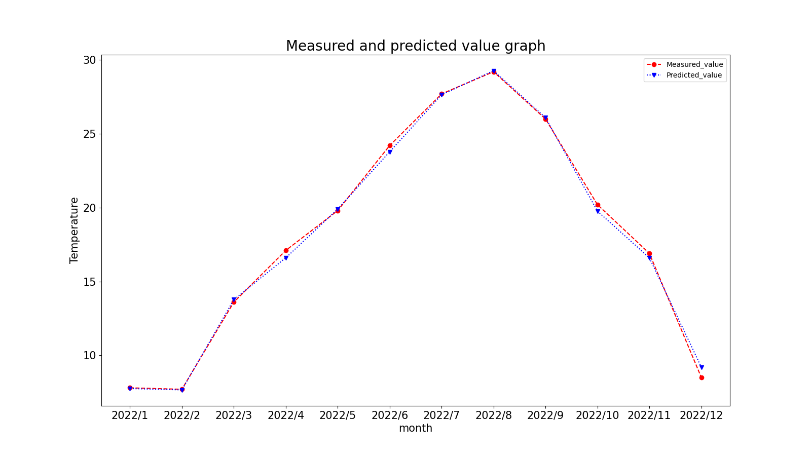

# Machine learning with random forests for average temperature prediction.

## Overview.
The machine learning algorithm Random Forest was used to predict the average temperature in Miyazaki Prefecture. The resulting RSME was around 0.3 for both training and test data. It also approximated 1 with respect to R^2.
As a consideration, it is considered that accurate predictions were made without over-learning due to learning from sufficient explanatory variables and sufficient records. The graph below shows the results obtained in this study.

## About learning
For the purpose of predicting the average temperature in Miyazaki, data from eight regions were trained: the eight regions are Sapporo, Sendai, Tokyo, Nagoya, Osaka, Hiroshima, Fukuoka and Okinawa. The objective variable is the average temperature. The explanatory variables are mean temperature (°C), mean daily maximum temperature (°C), mean daily minimum temperature (°C), total precipitation (mm), total precipitation (mm), maximum daily precipitation (mm), sunshine hours (hours), deepest snow cover (cm), deepest snow cover (cm), total snowfall (cm), mean wind speed (m/s), mean vapour pressure (hPa), average Average humidity (%), Average cloud cover (10-minute ratio).

## The data used
For data, you can download the data from [this page](https://www.data.jma.go.jp/gmd/risk/obsdl/index.php)of the　[Japan Meteorological Agency](https://www.jma.go.jp/jma/index.html).

## Learning procedure
Download data from the JMA. Put the data to be used as training in the directory [Train_data](Train_data). Put the data to be tested in the [Test_data](Test_data) directory. As you will be referring to these directories from the programme, it is advisable to download the data with the same objective and explanatory variables.

## Rights.
Source: the Meteorological Office (https://www.data.jma.go.jp/gmd/risk/obsdl/index.php)

This graph was produced under my responsibility.